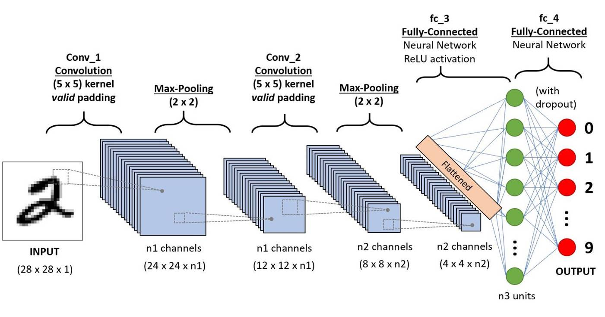
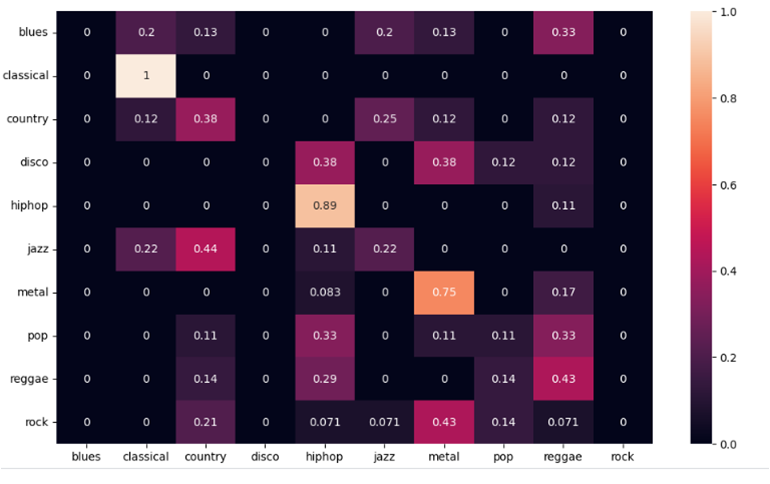

## <h1>Music Genre Classification with VGG16</h1>
<h2>Overview</h2>
This project focuses on classifying music genres using VGG16, a deep neural network model, on a dataset containing audio samples. The process involves converting audio files into Mel Spectrograms, which are then transformed into normalized tensors and used for training the VGG16 model.

## <h3>Colab Link:</h3> https://colab.research.google.com/drive/1tJ9_jFJNTPZ6900j9-0lHz9pfhL_dPTV

## <h3>Dataset Used:</h3>
It consists of 1,000 audio tracks, each lasting for 30 seconds, covering 10 different genres: blues, classical, country, disco, hiphop, jazz, metal, pop, reggae, and rock. The dataset provides a diverse set of musical genres and serves as a benchmark for evaluating algorithms and models in the field of audio signal processing and machine learning
Link: https://www.kaggle.com/datasets/andradaolteanu/gtzan-dataset-music-genre-classification

## Prerequisites:
Ensure the following packages are installed:
* numpy
* scikit-learn
* glob
* librosa
* pandas
* torch
* seaborn
* matplotlib

## Model Configuration:
VGG16 is employed as the base model, with its classifier modified to fit the specific requirements of the music genre classification task. The final layer is adjusted to output 10 classes corresponding to different music genres.

## Training:
The model is trained using a custom training loop, employing the Adam optimizer and CrossEntropyLoss. The training script outputs the loss at each epoch, and after training, the model's parameters are saved.

## Evaluation:
The accuracy of the trained model is evaluated on a validation dataset. The confusion matrix is visualized using seaborn, providing insights into the model's performance across different music genres.

## Usage:
* Run the provided script to convert audio files into Mel Spectrograms and set up the dataset.
* Execute the training script to train the VGG16 model on the music genre classification task.
* Evaluate the model's performance using the generated confusion matrix.
* Save the trained model parameters for future use.The trained model parameters are saved in model.pth, and the entire model directory is compressed into model.zip.

## Contribution Guidelines:
Feel free to explore and modify the code to suit your specific needs or datasets.

## Acknowledgments:
This project utilizes the power of VGG16 and various Python libraries for efficient music genre classification. Special thanks to the open-source community for their contributions.